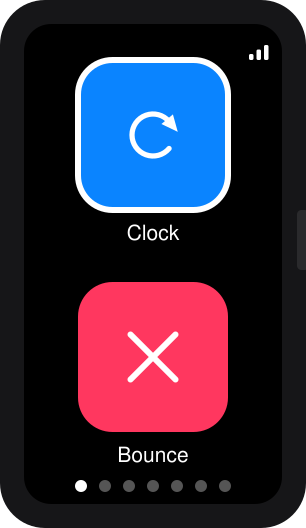

# Waveshare ESP32-C6 1.47" Touch Display App Launcher



*(Mockup of the home screen's layout/colors, generated from the launcher's actual code - not a device photo.)*

An iPhone-style home screen for the
[Waveshare ESP32-C6 1.47inch Touch Display Development Board](https://amzn.to/461uJnQ)
(172x320 resolution, 262K colors, Wi-Fi 6 / BLE 5, 160MHz RISC-V processor).
Two apps per page, page dots at the bottom, animated swipe-style transitions
between pages - navigated by tapping the touchscreen, with the board's single
BOOT button as a quick way home from inside an app.

## Hardware

- [Waveshare ESP32-C6 1.47inch Touch Display Development Board](https://amzn.to/461uJnQ),
  172x320, JD9853 driver (speaks the same command set as ST7789)
- AXS5106L capacitive touch controller - primary interface: tap icons to
  open apps, tap/drag within an app for its per-app action.
- QMI8658A IMU (not wired up yet).
- The **BOOT button** (GPIO9) is a quick press-to-go-home from inside an
  app; RESET just restarts the chip.
- No onboard NeoPixel on this board variant.
- Pin map lives in `include/config.h`.

This codebase also supports the plain
[(non-touch) Waveshare ESP32-C6-LCD-1.47](https://amzn.to/3SJ5qUm) via the
`waveshare-esp32c6-lcd147` PlatformIO environment - see `include/config.h`
and `platformio.ini` for the board-specific pin/behavior differences.
**The touch board is highly recommended** - it's the primary target this
project is built and tested against, and navigation is a much better
experience with tap/swipe than with the non-touch board's single-button
short/long-press scheme.

## Touch interaction model

**On the home screen:**
- **Tap an icon** - open that app directly.
- **Swipe left/right** - move between pages.

**Inside an app:**
- **Tap** - whatever that app defines (see each app's on-screen hint).
- **BOOT button (short press)** - go back to the home screen.

## Building & flashing

Requires [PlatformIO](https://platformio.org/) (`pipx install platformio`).

```sh
pio run -e waveshare-esp32c6-touch-lcd147                                    # compile
pio device list                                                              # find the board's serial port
pio run -e waveshare-esp32c6-touch-lcd147 -t upload --upload-port /dev/cu.usbmodemXXXX
```

If you only have one board plugged in, `pio run -e waveshare-esp32c6-touch-lcd147 -t upload`
will usually find the port automatically and you can drop `--upload-port`.
Always pass `-e waveshare-esp32c6-touch-lcd147` explicitly - running `pio run`
with no environment builds/uploads *both* board variants back-to-back, and
whichever one lands last (the plain, non-touch env) uses different display
pins and will leave the touch board's screen dark.

Serial logs (`pio device monitor`) print launcher state (which app opened/
closed) at 115200 baud - handy for debugging new apps. Note: this board's
USB-serial is a native USB-CDC port, so it briefly re-enumerates on reset;
if the monitor shows nothing, reconnect it after the board has settled.

### If the screen looks wrong

- **Upside down** - flip `LCD_ROTATION` in `include/config.h` from `0` to `2`.
- **Colors look off/inverted** - toggle `LV_COLOR_16_SWAP` in
  `include/lv_conf.h` (0 -> 1) and/or `pcfg.invert` in `src/display.cpp`.
- **Image shifted / black bars** - the panel sits inside a wider 240px-wide
  controller RAM window; `LCD_OFFSET_X` in `config.h` centers it. This is
  already set to the verified value (34) for this exact board.

## Adding a new app

This is the part meant for "vibe coding" - see `CLAUDE.md` for the full
walkthrough aimed at an AI assistant. Short version:

1. Copy `src/apps/stopwatch_app.cpp` and `.h` to `src/apps/your_app.cpp/.h`,
   rename `stopwatch_app` to `your_app` throughout.
2. Write your UI in `on_open(lv_obj_t *parent)`, clean up timers/hardware in
   `on_close()`, and optionally handle `on_short_press()`.
3. Register it in `src/app_registry.cpp` (add the include + one array entry).
4. `pio run -e waveshare-esp32c6-touch-lcd147 -t upload`.

The launcher automatically adds a new icon/page for it - no layout code to
touch, up to 16 apps (see `MAX_APPS` in `src/launcher.cpp`).

## Project layout

```
include/            Public headers: config.h (pins), app_interface.h,
                     app_registry.h, display.h, input.h, launcher.h, lv_conf.h
src/
  main.cpp           setup()/loop() glue
  display.cpp         LovyanGFX (JD9853/ST7789) + LVGL driver glue
  input.cpp            BOOT button short/long press state machine
  touch.cpp             AXS5106L touch controller driver (touch board only)
  launcher.cpp          Home screen: paging, highlight, app open/close
  app_registry.cpp       The list of installed apps
  apps/
    clock_app.cpp/.h        Uptime digital clock
    bounce_app.cpp/.h       DVD-logo-style bouncing ball
    breathe_app.cpp/.h      Guided breathing: bar rises on inhale, falls on exhale
    pong_app.cpp/.h         Pong against a beatable AI
    stopwatch_app.cpp/.h    Start/stop stopwatch
    wifi_app.cpp/.h         Scans nearby WiFi networks, shows signal strength
    photos_app.cpp/.h       Viewer for a handful of built-in CC0 photos
    bluetooth_app.cpp/.h    Scans nearby BLE devices
    stack_app.cpp/.h        Block-stacking game
    stock_app.cpp/.h        Stock price chart with swipeable timescales
    hn_app.cpp/.h           "News": Hacker News front-page stories, plus a
                            swipeable BBC World headlines page (touch board)
    birds_app.cpp/.h        Angry-Birds-style slingshot
    rgb_app.cpp/.h          NeoPixel color cycler (non-touch board only)
```
